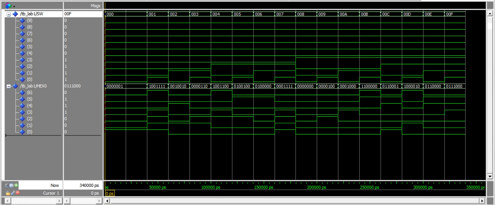
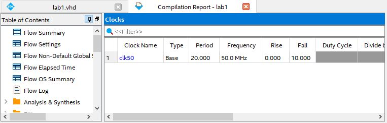
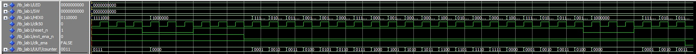
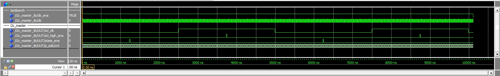
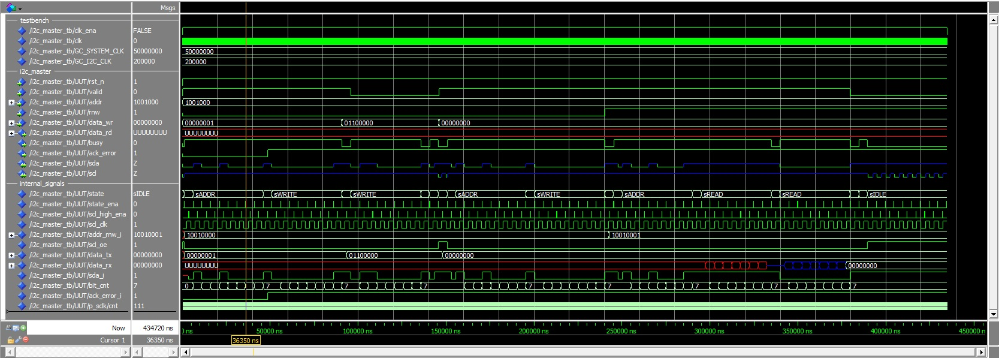
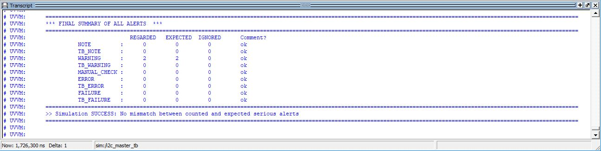
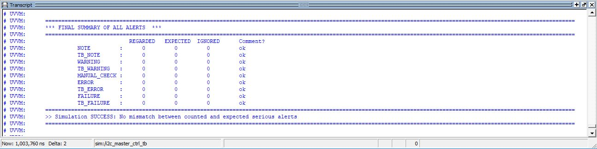
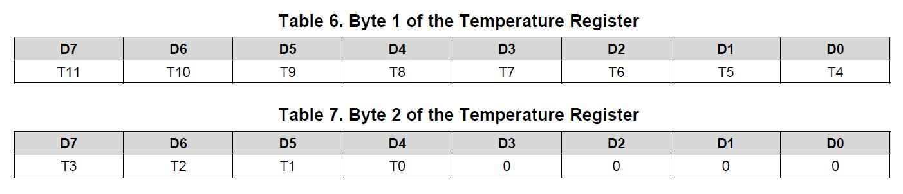
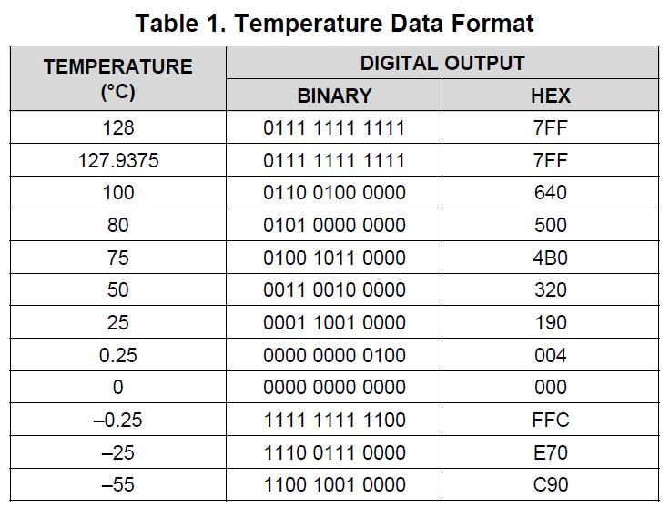

# FYS4220
Real time and embedded data systems

This repository contains multiple projects related to Fys422o course at Uio.

## Brief description of the course
This course gives and introduction to the design of digital and embedded systems using programmable logic (FPGA technology). This includes hardware description language (VHDL), verification and testing of digital designs, implementation of embedded systems in FPGAs, and the basic properties of Real-time operating systems.

### lab1 - part 1 A
This section of the lab familiarized us the usage of the IDE (Integrated Development Environment) used to develop firmware for the Cyclone V FPGA chip, including
* creating a new project, selecting the appropirate chip, creating a new vhdl file and compiling a skeleton vhdl code, that includes some switches and leds.
* assigning physical input and output pins to the module code written in vhdl by adding a Tool Command Language (TCL) script that defines the pins in a text file with extension .tcl  and adding the file to the project. The pin assignments can also be viewed or modified modified withing the IDE. 
* Being able to program the Development board by selecting the appropriate hardware and output file in .sop format and observe the code working accordingly as expected.

To test the first code on the board, we intend to use the 10 toggle switches to control the corresponding LEDs on top of them based on their state. We do this by simply adding the below.

    LED(9 downto 0) <= SW(9 downto 0);
    
Since both the LED and the switches array are both of 10 bits, we can get rid of the bit concatenation and directly write the code as below.

    LED <= SW;
    
    
### lab1 - part 1 B

This part of the lab takes the first 4 bits of the input switches and decodes the decimal value and displays it on the 7-segment display on the board. 

the TCL script is updated to assign the new pins for the 7-segment display.

The segment can be turned on or off by applying a low logic level or high
logic level from the FPGA, respectively. 

Each segment of the 7-segment display are active low, and hence can be turned on by applying a low logic level and turned off by a high logic level. 

The decoder is to be designed based on the pins assigned to the 7-segment display on the board. By reading the user manual of the DE1-SoC board, we find out the correct order to set the pin. The table below defines the bits to be set high or low for the 7-segment display decoder.

| Binary|Hex[6]|Hex[5]|Hex[4]|Hex[3]|Hex[2]|Hex[1]|Hex[0]|
|------:|-----:|-----:|-----:|-----:|-----:|-----:|-----:|
|0000   |1|0|0|0|0|0|0|
|0001   |1|1|1|1|0|0|1|
|0010   |0|1|0|0|1|0|0|
|0011   |0|1|1|0|0|0|0|
|0100   |0|0|1|1|0|0|1|
|0101   |0|0|1|0|0|1|0|
|0110   |0|0|0|0|0|1|0|
|0111   |1|1|1|1|0|0|0|
|1000   |0|0|0|0|0|0|0|
|1001   |0|0|1|0|0|0|0|
|1010   |0|0|0|1|0|0|0|
|1011   |0|0|0|0|0|1|1|
|1100   |1|0|0|0|1|1|0|
|1101   |0|1|0|0|0|0|1|
|1110   |0|0|0|0|1|1|0|
|1111   |0|0|0|1|1|1|0|

Based on the table, we can derive the fragment of the code that defines the decoder, as can be seen below. 
    
    with counter select
	    HEX0 <= 	"1000000" when "0000", -- 0
    			"1111001" when "0001", -- 1
    			"0100100" when "0010", -- 2
    			"0110000" when "0011", -- 3
    			"0011001" when "0100", -- 4
    			"0010010" when "0101", -- 5
    			"0000010" when "0110", -- 6
    			"1111000" when "0111", -- 7
    			"0000000" when "1000", -- 8
    			"0010000" when "1001", -- 9
    			"0001000" when "1010", -- A
    			"0000011" when "1011", -- b
    			"1000110" when "1100", -- C
    			"0100001" when "1101", -- d
    			"0000110" when "1110", -- E
    			"0001110" when "1111", -- F
			"1111111" when others;

THe tb_lab1.vhd file has been provided that generates stimulus for the simulation on ModelSim. Steps are followed to compile both the files in order of (lab1.vhd) and (tb_lab1.vhd) respectively, following which we are able to generate the waveform as can be seen below. 

### lab1 - part 2

THis section of the lab uses two keys (KEY[1] and KEY[0] )on the DE1-SoC board where one of the key is used to increment the counter value that is displayed on the 7-segment display and reset it to 0 on the press of the other key. The events are triggered on the rising edge of the pin connected to the pin. 

The trigger from the pins are detected on the edge of a clock used. 

The additional input pins from the keys and the signal form the clock oscillator are assgined on the TCL file and also defined in entity of the top hierarchy module. 

Below is the fragment of the code that defined in the architecture that increments the counter on the press of KEY[1] and resets the counter on the press of KEY[0]

    process(clk50) 
    begin
	    if reset_n = '0' then
		    counter <= "0000";
	    else if ext_ena_n = '0' then
		    counter <= counter + 1;
	    end if;
    end process;
	
We have tested the the timing analyzer to mae sure we get the correct frequency on the clk50 clock signal. 

The clock frequency, which by default was set to 1000 MHz have been changed to the correct clock frequency of the board, i.e. 50 MHz by creading the Synopsys Design Constraints (SDC) file, which have then been added to the project. 

The simulated result of the lab1 part2 is below

**Testing on the hardware**

The program has been tested on the hardware, however, the effect of the button debouncing causes the value to increment in steps of more than one. This is because the the value of the counter increments by polling KEY[1] (checking the logic level of KEY[1] at the edges of the rising clock of the clk50, which is run at a high frequency of 50MHz) rather than detecting the edge trigger from the KEY[1]. 

### lab2 - part 1
This part of the lab is aimed to generate the SCL clock signal for the I2C Master. The SCL Clock is to run at a frequency of 200kHz. This is done by incrementing the value of a counter on every rising edge of the cpu clock cycle. The cpu clock runs at 50 MHz, which means each period is 20ns. The SCL clock is to run at frequency of 200kHz, i.e. 5000nS. The counter must therefore increment upto 5000nS/20nS = 250 times to complete on SCL cycle. An external reset signal named 'rst_n' resets the value of the counter to 0 to indicate a reset.

Two internal signals named 'state_ena' and 'scl_high_ena' are dedicated to work as triggers, where the rising edge of the former signal transitions the state of the I2C and the later trigger generates the START and STOP conditions. Each of the trigger signal is on a low level and goes high for a single cpu clock cycle to generate the trigger. The 'state_ena' generates the trigger on the middle of the low period of SCL clock wheras 'scl_high_ena' generates the trigger on the high period of the SCL clock cycle.

This means the 'state_ena' needs to be triggerd on the 62.5th incremented value of the counter and the 'scl_high_ena' is to generate the trigger on 187.5 value of the counter. The signals are generated just as we expected.

### lab2 - part 2

This part of the lab designs the finite state machine of the I2C-Master which transitions on the two signal triggers we generated in part 1 of this lab. The state is defined as the code fragment below defining all the states used in the process:
	
	type state_type is (sIDLE, sSTART, sADDR, sACK1, sWRITE, sREAD, sACK2, sMACK, sSTOP);
	

The sda pin is used as a bidirectional pin and a high impedence value will be read as logic '1' and a low level will read a logic '0'. This is done by an asynchronous combinational logic outside the state process. The code fragment is as below:

	scl <= '0' when ((scl_oe = '1') and (scl_clk = '0')) else 'Z';
	sda <= 'Z' when (sda_i = '1') else '0';

We also had to keep in mind that the sensitivity list of this process will have no effect on the actual hardware, so we had to make sure we test our state transitions on by checking the logic level of the state_ena sampled on the crystal clock.

The I2C uses a 7 bit slave sddress concatenated with a single bit as the LSB of an 8 bit address which defines a read or write command. The address is loaded in the addr_rnw_i (7 downto 1).
The LSB, i.e. addr_rnw_i(0) is asigned to another internal single bit signal that defines the read or write command, as seen below:

	alias rnw_i : std_logic is addr_rnw_i(0); -- rnw_i is the least significant bit of the internal signal addr_rnw_i
	
The waveform generated gives the response to the stimulus generated by the testbench file just as we expected, which ensures that our procedural of the state machine is correct. 
	
	

### lab3 - part 1

Though our implementation of the state machine in Lab2 gave us the result we expected; a detailed test was required to ensure that the code is ready to be loaded into the hardware to provide us with the expected results. 
the Universal VHDL Verification Methodology (UVVM) testbench library is used to create a wrapper around the i2c_master module we created in Lab2. This wrapper imitates an I2C slave and also drives stimulus signals to the i2c_master entinty and compares the values that is generated with that expected by the  testbench library. 
Running the scripts will automatically compile our code and those of the library and the transcript output of the ModelSim will display the number of mismatched values in terms of warnings. The expected warnings was 2 and testing our module gave the output result as expected. A snapshot of the transcript output window is below:

### lab3 - part 2

This part of the lab creates the master wrapper over the i2c_master module obtain data from the TMP175 temperature sensor. The wrapper is a state machine that takes values from the switches on the board and displays the temperature on the leds on it.
We have implemented the state machine as per specification and everything worked as expected.

The buttons were sampled too fast due to a high speed crystal clock. Each button were latched and synchronized with the clock in a different process called p_sync. 

The p_load process was created that loaded the value before triggering the actual state machine to start, and having it in a different process made the loading asynchronous, which can allow us to load the value even when the othe process is busy acquiring data from the TMP175 sensor. 

In sWAIT_DATA, the state hop over to sWAIT_STOP after checking the byte_count value to be zero. The value is decremented on the next falling edge of busy, but the busy stays low when there is no more byte to read or write. This problem is solved by making sure the byte_count is a variable inside the process p_state and not a global signal. 

The testbench output has been compared to that given and it matches perfectly, indicating our state machine implementation follows the specifications provided in this lab. 

####Testing design in hardware: 

The pins have been assigned by using a tcl script according to the reference manual of the SOC_DE1 board. On programming the board, we follows the steps given in the lab specifications to load values to the TMP175 register and obtain the 12-bits temperature value returned in 2 bytes.
The first byte we receive is the MSB followd by 4-bits of the LSB shifted right on the second byte. The byte format is given below:

The datasheet of the TMP175 provides the relationship between the 12-bit digital output value to the temperature in Celcius. The relationship can be seen as below:

From the table, we can infer a linear relationship and derive the equation. 

	Slope = 25/400 = 50/800 = 0.0625
	Temperature = Slope x Digital Value
	Temperature = 0.0625 x Digital Value

	
We have tested running the program 3 times and 

| Sample|LSB|MSB|Digital Value (Bin)|Digital Value (Dec)|Temperature (°C)
|------:|-----:|-----:|-----:|-----:|-----:|
|1   |00011100|00010000|000111000001|449|28.0625|
|2   |00011101|00000000|000111010000|464|29|
|3   |00011100|01010000|000111000101|453|28.3125|

The room temperature can be seen to be between 28° Celcius and 29° Celcius. (Makes sense. Was kind of hot in here)
